# <!-- this_file: .architecture-diagram.md -->
# Vexy Stax JS - Architecture Diagrams

Visual documentation of system architecture, module relationships, and data flow.

**Last Updated**: 2025-11-05
**Version**: v0.2.0
**Iteration**: 67

---

## 📐 System Overview

### High-Level Architecture

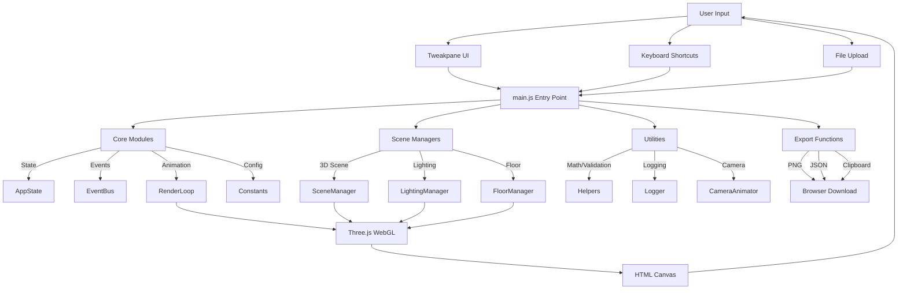

**Key Components**:
- **main.js**: 3,367-line entry point orchestrating all modules
- **Core Modules**: State management, event system, animation loop, configuration
- **Scene Managers**: Three.js scene, lighting, floor rendering
- **Utilities**: Math helpers, logging, camera animations
- **UI Layer**: Tweakpane controls + keyboard shortcuts

---

## 🔌 Module Dependencies

### Dependency Graph

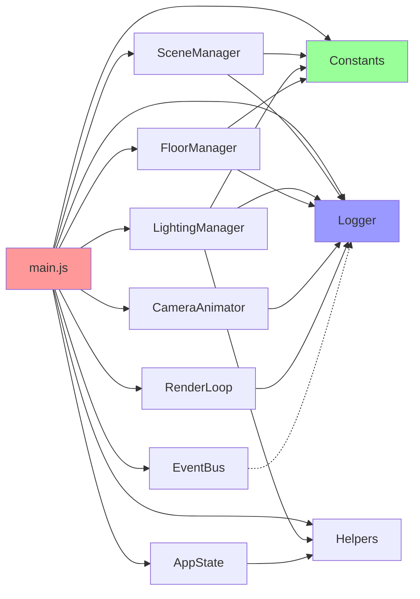

**Dependency Levels**:
- **Level 0** (No dependencies): Constants, Logger, Helpers, EventBus
- **Level 1** (Core utilities): AppState, RenderLoop, CameraAnimator
- **Level 2** (Scene components): SceneManager, LightingManager, FloorManager
- **Level 3** (Application): main.js

**Import Strategy**: Bottom-up (utilities → managers → application)

---

## 🔄 Data Flow Architecture

### State Management Flow

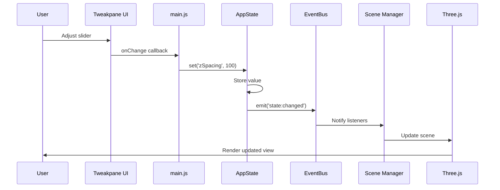

**State Flow Characteristics**:
- **Centralized**: All state in AppState singleton
- **Event-driven**: Changes broadcast via EventBus
- **Reactive**: UI updates trigger cascade of scene updates
- **Unidirectional**: User → UI → State → Managers → Render

---

### Image Loading Flow

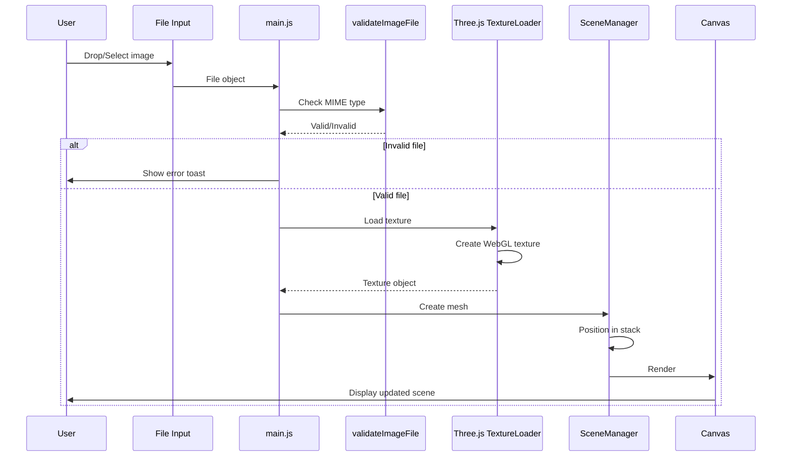

**Loading Characteristics**:
- **Validation first**: MIME type + size checks before loading
- **Retry logic**: 3 attempts with exponential backoff (100ms, 200ms, 400ms)
- **Memory monitoring**: Warns at 500MB, blocks at 1000MB
- **Stack positioning**: Z-position based on index × zSpacing

---

## 🧱 Core Module Architecture

### Core Utilities

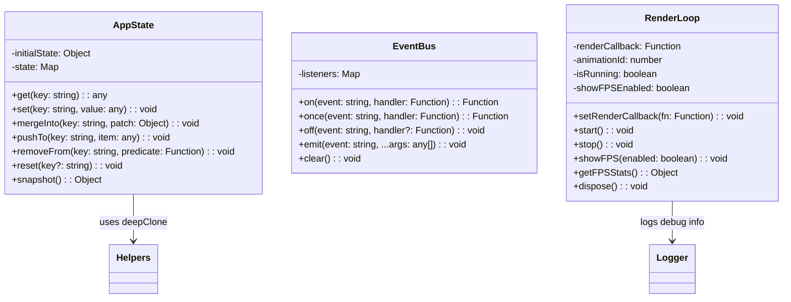

**Design Patterns**:
- **Singleton**: AppState, EventBus, RenderLoop (single instances)
- **Observer**: EventBus pub/sub for decoupled communication
- **Memento**: AppState snapshot/reset for undo/redo
- **Command**: RenderLoop callback pattern for render control

---

### Scene Management

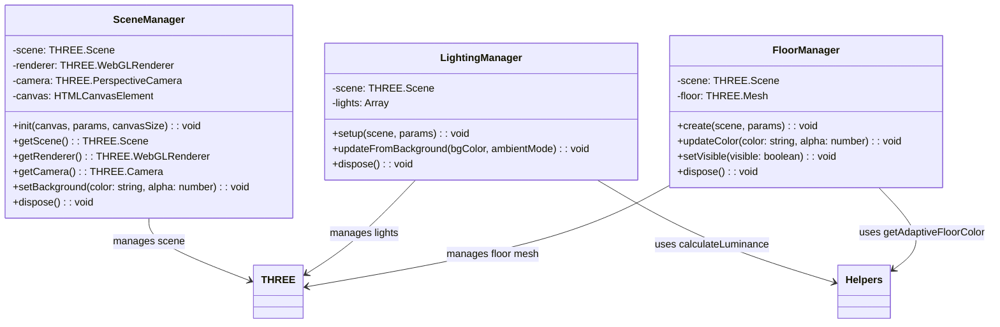

**Lifecycle**:
1. **Init**: SceneManager creates scene, renderer, camera
2. **Setup**: LightingManager adds lights, FloorManager creates floor
3. **Update**: Managers respond to state changes via EventBus
4. **Dispose**: All managers clean up WebGL resources

---

## 🎨 Rendering Pipeline

### Render Cycle

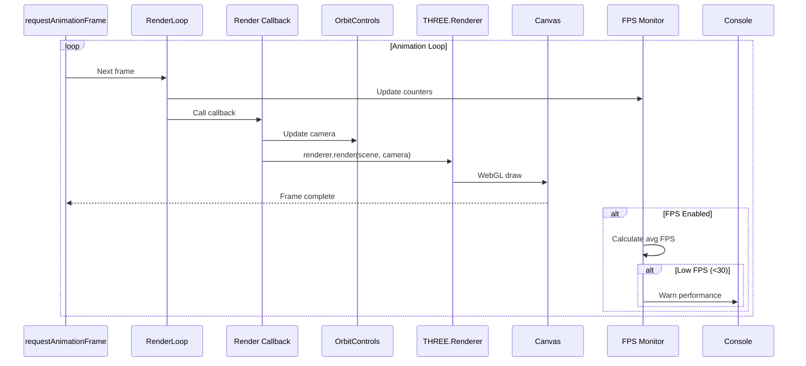

**Performance Characteristics**:
- **Target**: 60 FPS (16.67ms per frame)
- **Warning threshold**: <30 FPS
- **Optimization**: OrbitControls.enableDamping for smooth movement
- **Memory**: Context loss recovery handles GPU resets

---

## 💾 Export Architecture

### Export Data Flow

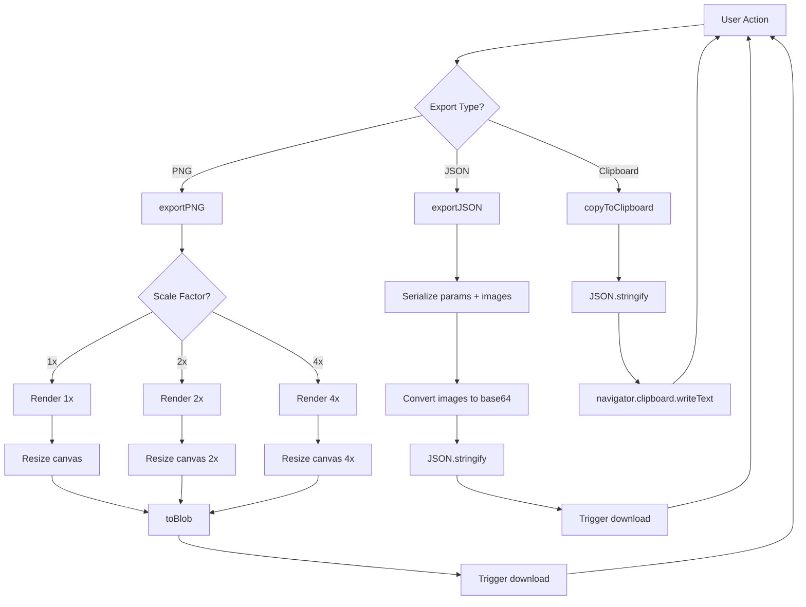

**Export Features**:
- **PNG**: 1x/2x/4x scale, transparent background option
- **JSON**: Complete scene state + base64 image data
- **Clipboard**: JSON copied for paste into code/tools

---

## 🔐 Security & Validation

### Input Validation Flow

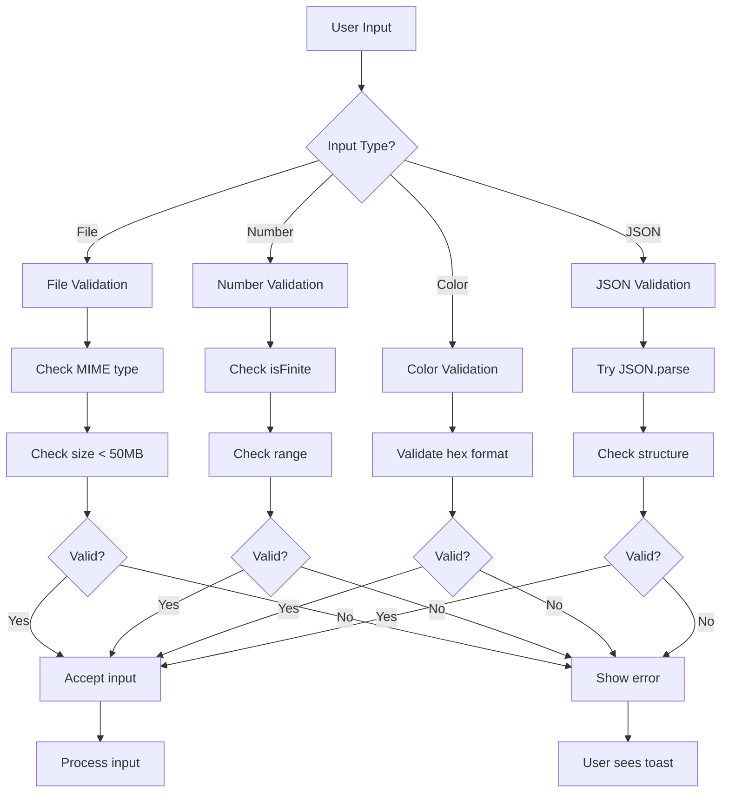

**Validation Strategy**:
- **Type checking**: Reject non-numbers, non-strings early
- **Range checking**: Enforce min/max bounds (zSpacing 0-500, etc.)
- **Size limits**: 50MB per file, 1000MB total memory
- **Format validation**: Hex colors, MIME types, JSON structure

---

## 🧩 Plugin Architecture (Future)

### Extensibility Design (Phase 5)

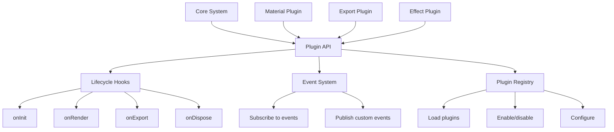

**Future Plugin Types**:
- **Material plugins**: Custom shaders, procedural textures
- **Export plugins**: MP4/WebM video, GIF animation, 3D formats
- **Effect plugins**: Post-processing, filters, distortions
- **UI plugins**: Custom controls, themes, layouts

---

## 📊 Performance Monitoring

### Monitoring Architecture

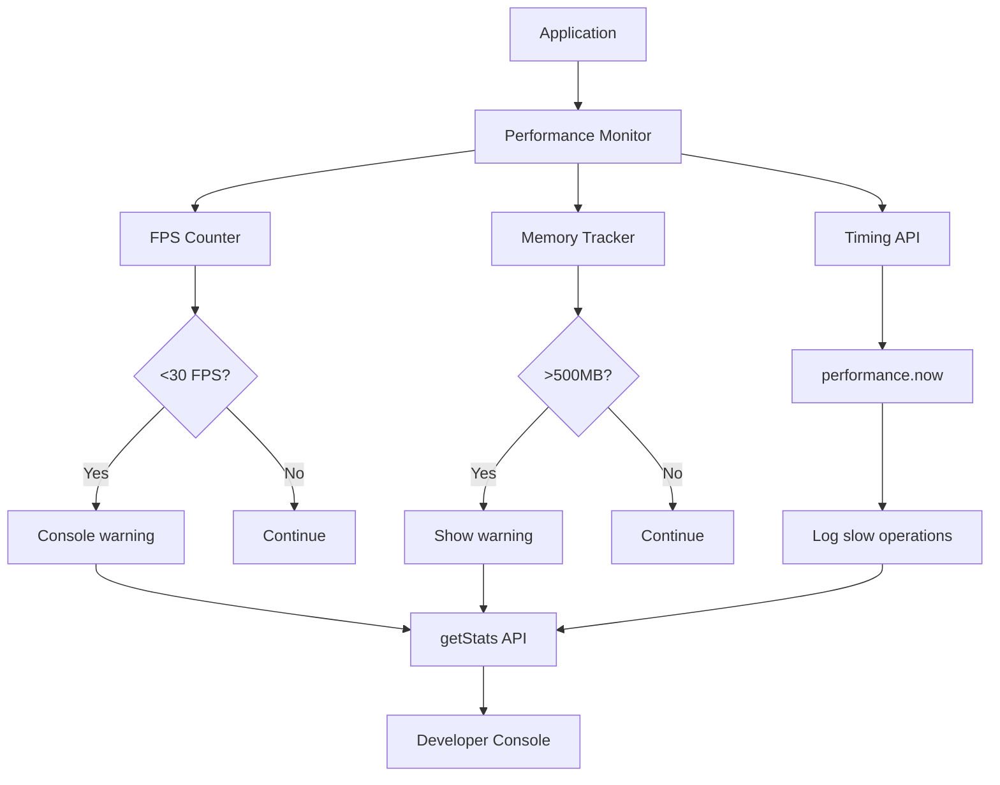

**Monitoring Features**:
- **FPS**: Real-time average over 1-second window
- **Memory**: Estimated texture memory (width × height × 4 bytes)
- **Timing**: Critical operations logged with duration
- **Warnings**: Automatic alerts for performance issues

---

## 🔗 Module Communication

### Event-Driven Communication

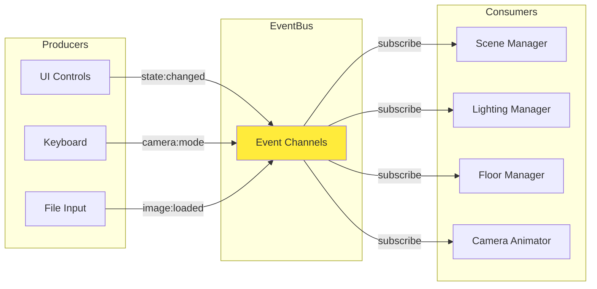

**Event Channels**:
- `state:changed` - AppState updates
- `camera:mode` - Camera mode switches
- `image:loaded` - New image added to stack
- `image:removed` - Image removed from stack
- `material:changed` - Material preset changed

---

## 📖 Related Documentation

- [PLAN.md](PLAN.md) - Strategic planning and module extraction roadmap
- [.project-metrics.md](.project-metrics.md) - Current architecture statistics
- [DEPENDENCIES.md](DEPENDENCIES.md) - External dependencies (Three.js, Tweakpane, GSAP)
- [.testing-guide.md](.testing-guide.md) - Testing architecture and strategies

---

**Architecture Status**: ✅ Modular, testable, extensible

*Diagrams generated with Mermaid - view in GitHub or compatible Markdown viewer*
