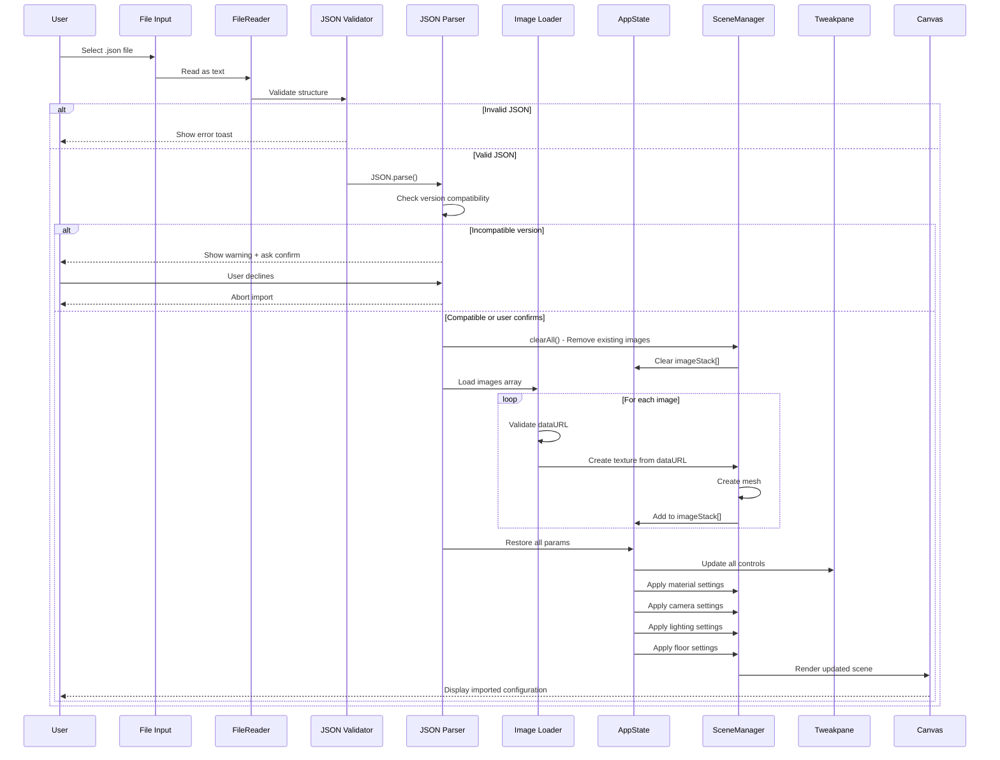

# <!-- this_file: .workflow-diagram.md -->
# Vexy Stax JS - Workflow Diagrams

Visual documentation of data flow through the application from user input to final output.

**Last Updated**: 2025-11-05
**Version**: v0.2.0
**Iteration**: 67

---

## 📊 Complete Application Flow

### End-to-End User Journey


---

## 📁 File Upload Workflow

### Image Loading and Validation


**Key Points**:
- MIME type validation: `image/png`, `image/jpeg`, `image/gif`, `image/webp`, `image/svg+xml`
- File size: 50MB hard limit, 10MB warning
- Memory monitoring: 500MB warning, 1000MB critical (with user confirmation)
- Retry logic: 3 attempts with exponential backoff (100ms, 200ms, 400ms)
- Z-positioning: `mesh.position.z = index * zSpacing` (default 50px)

---

## 🎛️ Parameter Change Workflow

### UI Control to Scene Update


**Key Parameters**:
- **zSpacing** (0-500px): Distance between layers
- **materialPreset**: 10 presets (flat-matte, glossy-photo, plastic-card, thick-board, metal-sheet, glass-slide, 3d-box, metallic-card, satin, soft-glow)
- **roughness** (0-1): Material surface roughness
- **metalness** (0-1): Metallic appearance
- **thickness** (1-50): Mesh depth for 3D box material
- **cameraMode**: perspective, orthographic, isometric, telephoto
- **viewpoint**: front, top, beauty, side, 3d-stack, center, isometric

---

## 📷 Camera Animation Workflow

### Viewpoint Preset Transitions


**Preset Positions**:
- **front**: (0, 0, 800) - Straight-on view
- **top**: (0, 800, 0) - Bird's eye view
- **beauty**: (-300, 200, 500) - Classic 3/4 angle
- **side**: (-800, 0, 0) - Profile view
- **3d-stack**: (-400, 300, 400) - Isometric-style
- **center**: (0, 0, 600) - Centered perspective
- **isometric**: (-577, 577, 577) - True isometric (45°)

**Animation Details**:
- Duration: 1.5 seconds
- Easing: GSAP `power2.inOut`
- Both camera position and target animated simultaneously
- OrbitControls disabled during animation, re-enabled after

---

## 💾 Export Workflows

### PNG Export (High-Resolution Render)


**PNG Export Details**:
- Scales: 1x (current), 2x (retina), 4x (print quality)
- Format: PNG with full alpha channel
- Background: Transparent if bgAlpha < 1.0
- Antialiasing: Enabled in renderer
- Filename: `vexy-stax-${timestamp}.png`
- Temporary upscaling: Canvas resized, rendered, then restored

---

### JSON Export (Full Scene Save)

```mermaid
flowchart TD
    Start([User clicks Export JSON]) --> GetState[Get AppState snapshot]

    GetState --> SerializeParams[Serialize all parameters]
    SerializeParams --> GetImages[Get imageStack from AppState]

    GetImages --> LoopImages{For each image}

    LoopImages --> GetMesh[Get mesh.userData]
    GetMesh --> GetTexture[Get mesh.material.map]
    GetTexture --> ExtractData[Extract texture.image src]

    ExtractData --> CheckType{Data URL?}

    CheckType -->|Yes| UseDataURL[Use existing dataURL]
    CheckType -->|No| ConvertCanvas[Convert canvas to base64]

    UseDataURL --> BuildObj[Build image object]
    ConvertCanvas --> BuildObj

    BuildObj --> AddToArray[Add to images array]
    AddToArray --> LoopImages

    LoopImages -->|All done| BuildJSON[Build final JSON structure]

    BuildJSON --> AddVersion[Add version: "0.2.0"]
    AddVersion --> AddImages[Add images array]
    AddImages --> AddParams[Add params object]

    AddParams --> Stringify[JSON.stringify with indentation]
    Stringify --> CreateBlob[Create Blob type: application/json]
    CreateBlob --> CreateLink[Create download link]
    CreateLink --> Filename[vexy-stax-YYYY-MM-DD-HH-mm-ss.json]
    Filename --> Download[Trigger browser download]

    Download --> End([JSON Downloaded])

    style Start fill:#90EE90
    style End fill:#87CEEB
    style Stringify fill:#FFD700
```

**JSON Structure**:
```json
{
  "version": "0.2.0",
  "images": [
    {
      "filename": "image-1.png",
      "dataURL": "data:image/png;base64,iVBORw0KG..."
    }
  ],
  "params": {
    "zSpacing": 50,
    "cameraMode": "perspective",
    "materialPreset": "glossy-photo",
    ...
  }
}
```

**Key Points**:
- All parameters saved (camera, material, lighting, floor)
- Images embedded as base64 data URLs
- Version field for compatibility checking
- Pretty-printed with 2-space indentation
- Import validates version and structure

---

## 📋 JSON Import Workflow

### Loading Saved Configurations



**Validation Checks**:
1. **JSON syntax**: Valid parseable JSON
2. **Version field**: Must have `"version"` string
3. **Images array**: Must be array with `filename` and `dataURL` properties
4. **Params object**: Must have required material/camera parameters
5. **Data URLs**: Must start with `data:image/`

**Import Actions**:
- Clear existing scene completely
- Load all images sequentially (maintain order)
- Restore all parameters to AppState
- Sync UI controls to match imported state
- Trigger full scene rebuild

---

## 🔄 State Management Flow

### Centralized State with Event-Driven Updates


**State Operations**:
- **get(key)**: Retrieve value from state Map
- **set(key, value)**: Store value, emit `state:changed`
- **mergeInto(key, patch)**: Deep merge for nested objects
- **pushTo(key, item)**: Add to array property
- **removeFrom(key, predicate)**: Remove from array
- **reset(key)**: Restore initial value
- **snapshot()**: Get full state copy

**Event Channels**:
- `state:changed` - Any state modification
- `camera:mode` - Camera mode switch
- `image:loaded` - New image added
- `image:removed` - Image deleted
- `material:changed` - Material preset change

---

## ⚡ Render Loop Flow

### Animation Frame Management


**Performance Characteristics**:
- **Target**: 60 FPS (16.67ms per frame)
- **Warning**: <30 FPS triggers console warning
- **FPS calculation**: Rolling average over 1 second window
- **Frame budget**: ~16ms for JavaScript + render
- **Optimization**: OrbitControls.enableDamping = true (smooth movement)

**RenderLoop API**:
- `setRenderCallback(fn)` - Set function called each frame
- `start()` - Begin animation loop
- `stop()` - Cancel animation loop
- `showFPS(enabled)` - Toggle FPS display
- `getFPSStats()` - Get current FPS metrics

---

## 🔍 Error Recovery Workflows

### WebGL Context Loss Recovery


**Recovery Actions**:
1. **Context loss detected**: Display user warning
2. **Prevent default**: Keep canvas alive for restoration
3. **Context restored**: Remove warning, rebuild scene
4. **Texture reload**: Re-upload all images to GPU
5. **Settings restore**: shadowMap, clearColor, canvas dimensions

---

## 🧪 Testing Workflow

### Unit Test Execution Flow


**Test Execution Details**:
- **Runtime**: ~650ms for all 223 tests
- **Coverage**: 96% core, 100% utils
- **Test runner**: Node.js built-in test runner (v18+)
- **Watch mode**: Not used (run once per iteration)
- **Parallel**: Tests run in parallel across files
- **Timeout**: Default 30 seconds per test

---

## 🎯 Related Documentation

- [.architecture-diagram.md](.architecture-diagram.md) - System architecture with Mermaid diagrams
- [.project-metrics.md](.project-metrics.md) - Project statistics and health metrics
- [.documentation-index.md](.documentation-index.md) - Complete documentation navigation
- [.testing-guide.md](.testing-guide.md) - Testing standards and patterns
- [.cicd-workflow.md](.cicd-workflow.md) - CI/CD pipeline documentation

---

**Workflow Status**: ✅ Complete application data flow documented

*Diagrams generated with Mermaid - view in GitHub or compatible Markdown viewer*
